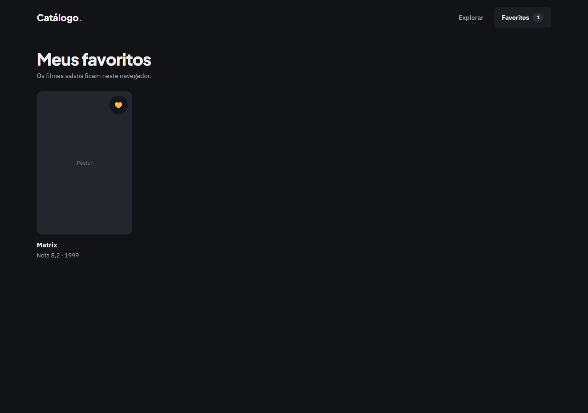
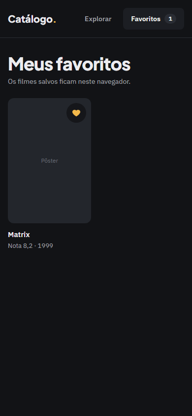

# Evidência — Task #L9-3 — Favoritos e imagens

**Parent item pai:** #L9 — Correções da revisão da entrega: defeitos de borda na listagem, nos favoritos e no detalhe, 404 em português e com status real, README (clone, contagens, processo) e registros
**Data:** 2026-10-08

## Resumo
O caminho de imagem do TMDB passou a ser validado no único lugar que monta a URL. Um favorito com `posterPath` adulterado no `localStorage` é mantido, sem pôster, em vez de derrubar `/favoritos` com erro de render.

## Tasks de execução realizadas
- [x] 3.1 Caminho de imagem validado em `images.ts`
- [x] 3.2 Favorito com pôster inválido é mantido sem pôster

## Arquivos impactados
| Arquivo | Ação | Descrição |
|---------|------|-----------|
| `src/lib/tmdb/images.ts` | alterado | `isTmdbImagePath` exportada (`^/[A-Za-z0-9_-]+\.(jpg|jpeg|png|webp|svg)$`); `imageUrl` devolve `null` para o resto |
| `src/lib/tmdb/images.test.ts` | alterado | `/../../etc.jpg`, sem barra inicial, com `?`, barra dupla, URL absoluta, extensão desconhecida e os caminhos das fixtures |
| `src/lib/favorites/store.ts` | alterado | `toFavoriteSnapshot` grava `posterPath: null` quando o caminho é recusado |
| `src/lib/favorites/store.test.ts` | alterado | Payload com `posterPath` adulterado mantém o item e zera o pôster |
| `src/components/favorites/FavoriteButton.test.tsx` | alterado | Ajuste de fixture ao novo formato |

## Decisões técnicas
Decisão 5 (D48): a defesa fica em `images.ts`, que protege cards, detalhe e elenco, venha o valor da API ou do `localStorage`. `isFavoriteSnapshot` não muda. Alternativa descartada: descartar o item, que perderia um favorito legítimo por um campo cosmético.

## Resultado
Os caminhos das fixtures continuam gerando URL; os adulterados devolvem `null`. `/favoritos` com o payload adulterado mostra o card com o placeholder de pôster e sem tela de erro.

## Resultado do QA
Lido do bloco `qa` do arquivo de estado do change em `.work/changes/archive/2026-10-08-correcoes-entrega/` (2 iterações, 14 findings resolvidos, nenhum em aberto, `status: passed`). Nada foi rodado de novo para esta evidência.
- **E2E:** `pass`. `npm run e2e` registrou 132 execuções passadas e 0 skipped: 66 testes em 5 specs (`correcoes-entrega` 10, `detalhe-filme` 16, `favoritos` 22, `listagem-filmes` 16, `shell` 2), cada um nos projetos `desktop` (1280 px) e `mobile` (390 px). A contagem por spec vem de `playwright test --list` no projeto desktop. O cenário desta task não depende do TMDB.
- **Layout:** `pass`. Gates de `e2e/support/layout.ts` em 1280 e 390 px e revisão visual do screenshot, sem findings em aberto.

Tela do change nesta task:

| Tela | Desktop | Mobile |
|------|---------|--------|
| Favorito com pôster adulterado |  |  |

## Observações
O cenário do E2E grava o payload adulterado no `localStorage` de propósito: o payload adulterado é o objeto do teste, não um atalho para pular um passo da interface.
