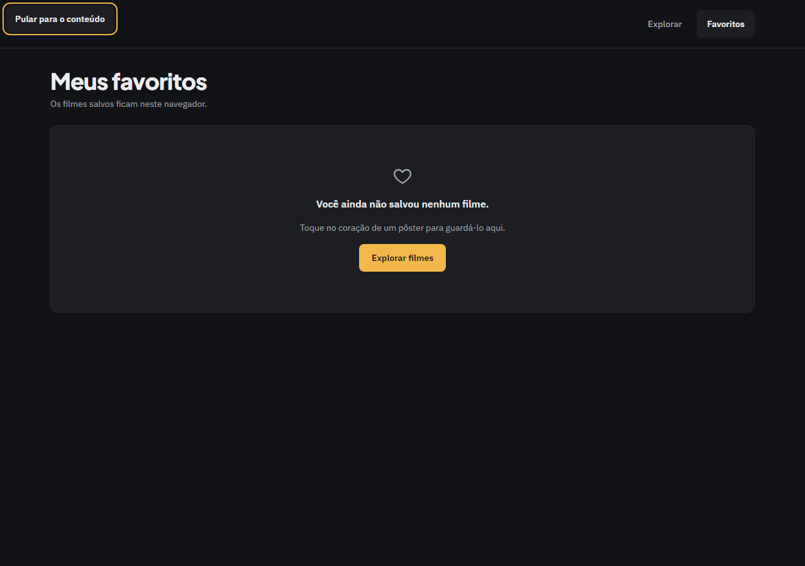
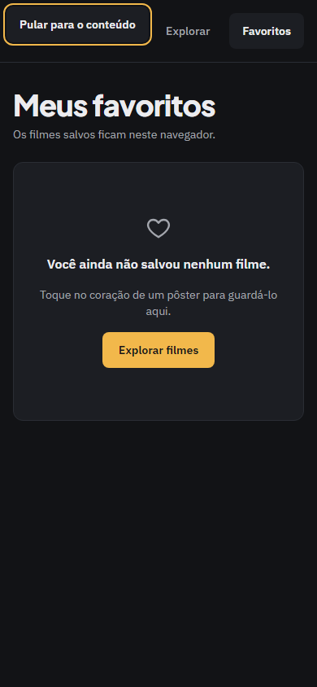

# Evidência — Task #L9-5 — Shell e acessibilidade

**Parent item pai:** #L9 — Correções da revisão da entrega: defeitos de borda na listagem, nos favoritos e no detalhe, 404 em português e com status real, README (clone, contagens, processo) e registros
**Data:** 2026-10-08

## Resumo
O layout ganhou o link "Pular para o conteúdo" e as telas de erro e de não encontrado passaram a ter exatamente um `h1`, em vez de um `h2` sem `h1` na página.

## Tasks de execução realizadas
- [x] 5.1 Skip-link no layout
- [x] 5.2 `h1` nas telas de erro e de não encontrado

## Arquivos impactados
| Arquivo | Ação | Descrição |
|---------|------|-----------|
| `src/app/layout.tsx` | alterado | Skip-link como primeiro elemento do `body`; `main` com `id="conteudo"`, `tabIndex={-1}` e `focus:outline-none` |
| `src/components/ui/EmptyState.tsx` | alterado | Prop `headingLevel?: 1 \| 2` (padrão 2), mesmas classes nos dois níveis |
| `src/components/ui/EmptyState.test.tsx` | alterado | Testes do nível |
| `src/components/ui/ErrorState.tsx` | alterado | Passa `headingLevel={1}` |
| `src/components/ui/ErrorState.test.tsx` | alterado | Teste do `h1` |
| `src/app/movie/[id]/not-found.tsx` | alterado | `headingLevel={1}` |

## Decisões técnicas
Decisão 10: link visível só com foco (`sr-only focus:not-sr-only`), com `bg-surface-100`, `text-text-primary` e `outline-focus-ring`; sem ilha client; o padding só vale com foco, senão o link não ficava invisível sem foco. Decisão 9: nas telas que substituem a página inteira o título é `h1`; os estados vazios da listagem e dos favoritos ficam em `h2` sob o `h1` da página. Como as classes são as mesmas nos dois níveis, o `h1` de "Página não encontrada" usa a fonte do corpo, e o E2E não confere `--font-heading` nele.

## Resultado
O primeiro Tab em qualquer página foca o link, visível; Enter leva o foco ao `main`. Listagem, busca vazia, favoritos vazio, erro, filme não encontrado e página não encontrada têm um `h1` cada.

## Resultado do QA
Lido do bloco `qa` do arquivo de estado do change em `.work/changes/correcoes-entrega/` (2 iterações, 14 findings resolvidos, nenhum em aberto, `status: passed`). Nada foi rodado de novo para esta evidência.
- **E2E:** `pass`. `npm run e2e` registrou 132 execuções passadas e 0 skipped: 66 testes em 5 specs (`correcoes-entrega` 10, `detalhe-filme` 16, `favoritos` 22, `listagem-filmes` 16, `shell` 2), cada um nos projetos `desktop` (1280 px) e `mobile` (390 px). Os cenários do skip-link não dependem do TMDB.
- **Layout:** `pass`. Gates de `e2e/support/layout.ts` em 1280 e 390 px (inclui o anel de foco) e revisão visual do screenshot, sem findings em aberto.

Tela do change nesta task:

| Tela | Desktop | Mobile |
|------|---------|--------|
| Skip-link com foco |  |  |

## Observações
O `h1` da tela de erro (`error.tsx`) não tem E2E, porque a falha acontece no servidor; é coberto por `ErrorState.test.tsx`. As telas de não encontrado, que também ganharam `h1`, têm screenshot na task #L9-4.
