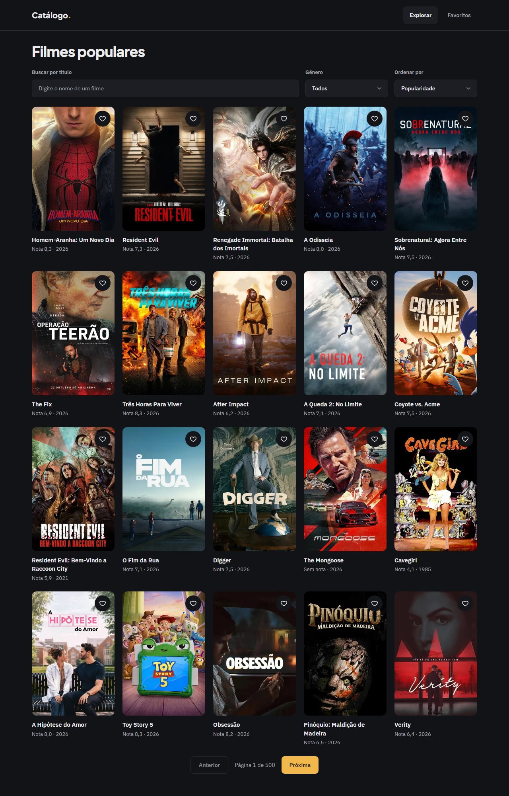
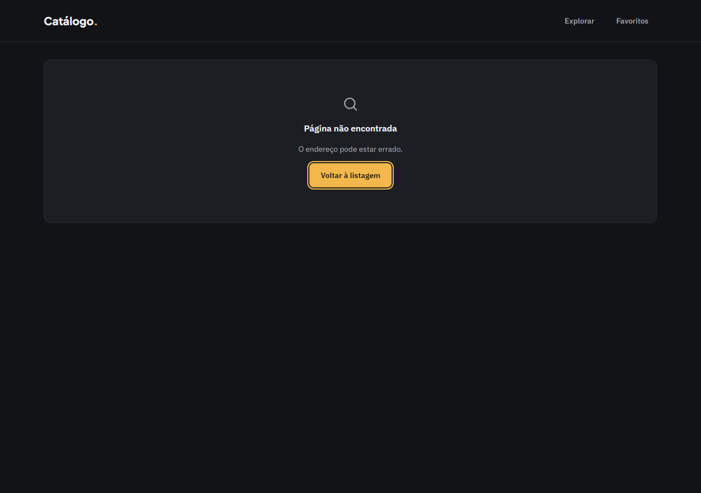
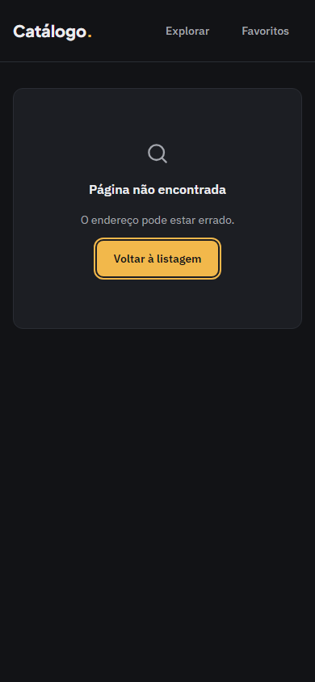
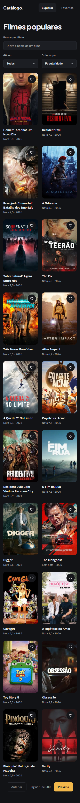
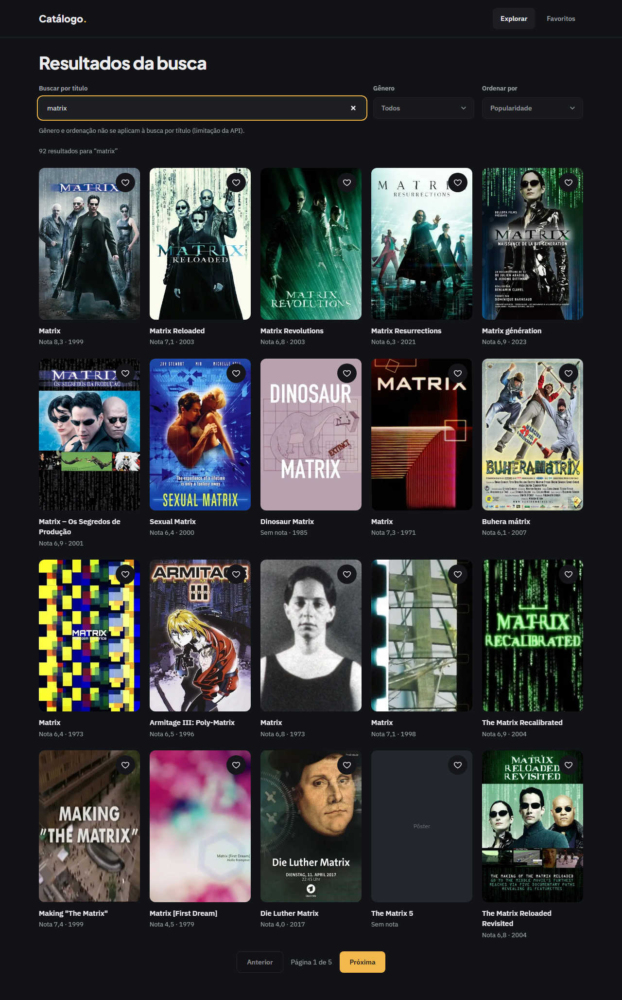
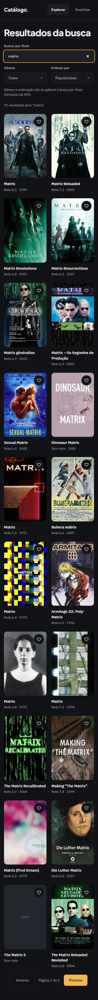

# Evidência — Task #L9-9 — E2E

**Parent item pai:** #L9 — Correções da revisão da entrega: defeitos de borda na listagem, nos favoritos e no detalhe, 404 em português e com status real, README (clone, contagens, processo) e registros
**Data:** 2026-10-08

## Resumo
Os comportamentos corrigidos ganharam cobertura de ponta a ponta em `e2e/correcoes-entrega.spec.ts`, e os dois specs existentes foram ajustados ao que mudou (404 real para id inválido; fim do cenário de gênero sem resultado). Dois cenários ficaram sem E2E, declarados abaixo.

## Tasks de execução realizadas
- [x] 9.1 E2E dos comportamentos corrigidos

## Arquivos impactados
| Arquivo | Ação | Descrição |
|---------|------|-----------|
| `e2e/correcoes-entrega.spec.ts` | criado | 10 testes: a última ação vence; gênero desconhecido vira Todos; título acompanha a busca (e a URL direta de uma busca); carregamento da paginação; favorito com pôster adulterado; `/naoexiste`; `/movie` sem id; skip-link (dois cenários) |
| `e2e/detalhe-filme.spec.ts` | alterado | Ids inválidos esperam status 404 e a tela da raiz; filme inexistente confere 200 e `h1` único |
| `e2e/listagem-filmes.spec.ts` | alterado | Removido o teste "gênero sem resultado mostra Limpar filtros" (ver Observações) |

## Decisões técnicas
Decisão 17 e as regras de `qa.default.dimensions.e2e`: chegar à tela pela interface; `page.goto` direto só onde a URL é o requisito (busca por URL, `/naoexiste`, ids inválidos); telas com TMDB começam com `requiresTmdb()` e afirmam estrutura, não título fixo; seletores por papel e nome acessível; screenshots por `captureLayout`. O teste da corrida foi quebrado de propósito (sem o cancelamento do timer) e ficou vermelho; o código foi restaurado.

## Resultado
`npm run e2e` (registrado no QA, não rodado de novo aqui): 132 execuções passadas, 0 skipped, 66 testes em 5 specs nos projetos `desktop` (1280 px) e `mobile` (390 px): `correcoes-entrega` 10, `detalhe-filme` 16, `favoritos` 22, `listagem-filmes` 16, `shell` 2.

## Resultado do QA
Lido do bloco `qa` do arquivo de estado do change em `.work/changes/correcoes-entrega/`: 2 iterações, 14 findings resolvidos, nenhum em aberto, `status: passed`; `functional: pass` (`npm run check` com 409 testes em 35 arquivos, e `npm run build`), `e2e: pass`, `layout: pass`.
- **E2E:** números acima. A contagem por spec vem de `playwright test --list` no projeto desktop.
- **Layout:** gates em 1280 e 390 px e revisão visual, sem findings em aberto. O estado pendente da paginação foi conferido pelo código, não por screenshot.

Todas as telas do change, em desktop e mobile:

| Tela | Desktop | Mobile |
|------|---------|--------|
| Gênero desconhecido |  |  |
| Favorito com pôster adulterado |  |  |
| Página não encontrada |  |  |
| Skip-link com foco |  |  |
| Listagem carregada |  |  |
| Busca |  |  |
| Id inválido |  |  |
| Filme não encontrado |  |  |

## Observações
Dois cenários ficaram **sem teste de ponta a ponta**, declarados em `qa.not_covered_e2e` do arquivo de estado do change e na seção "Testes" do README:
1. **Estado vazio por filtros ("Limpar filtros").** Não há combinação estável de filtros sem resultado no TMDB real. A escolha do estado é coberta por `resolveEmptyState.test`; o botão no navegador não tem cobertura.
2. **Sinopse e trailer com `TMDB_LANGUAGE` diferente de `pt-BR`.** O servidor de E2E tem um idioma só. Cobertos apenas por teste unitário.

Também sem E2E, por acontecerem no servidor: a tela de erro (`error.tsx`), conferida manualmente e por teste unitário.
