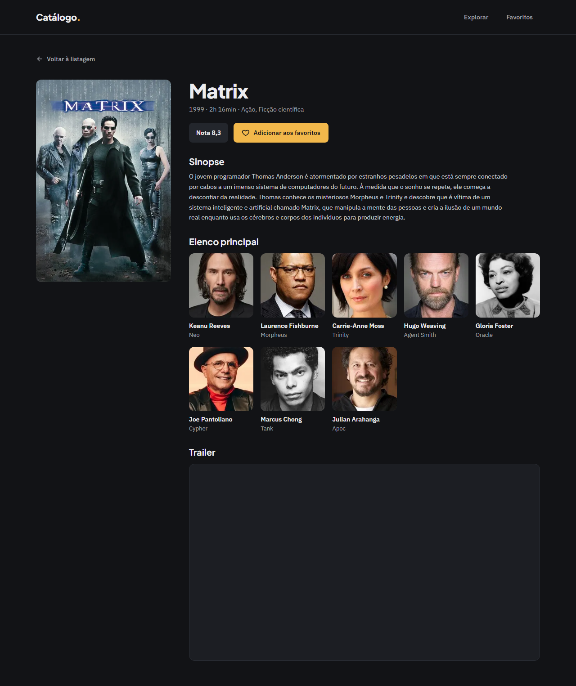
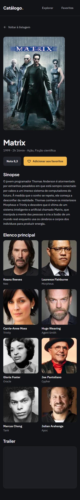
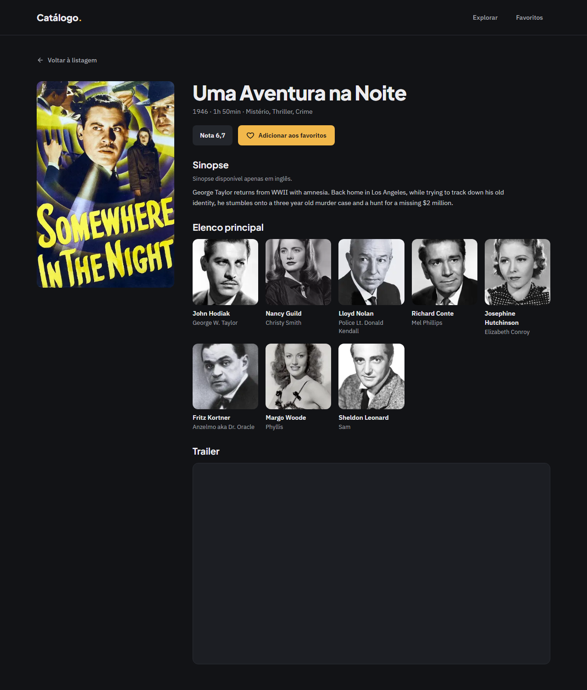
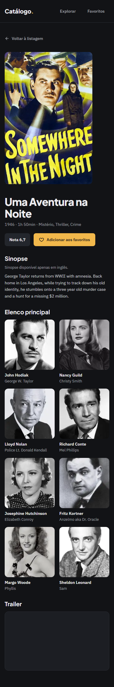
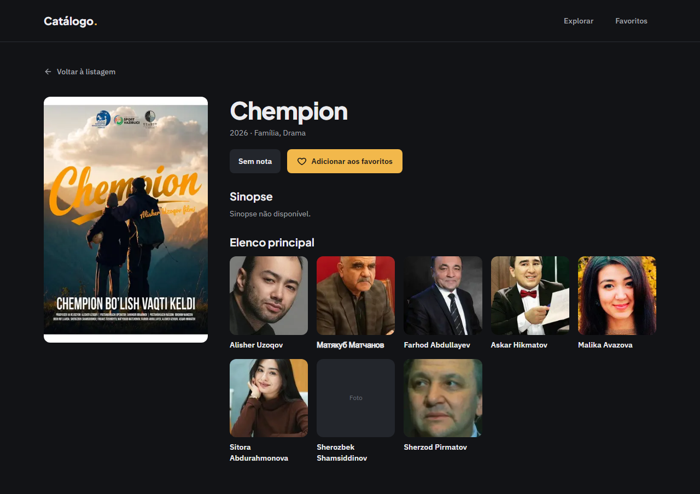
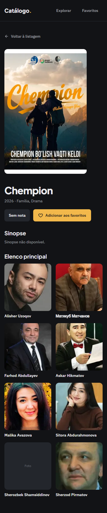
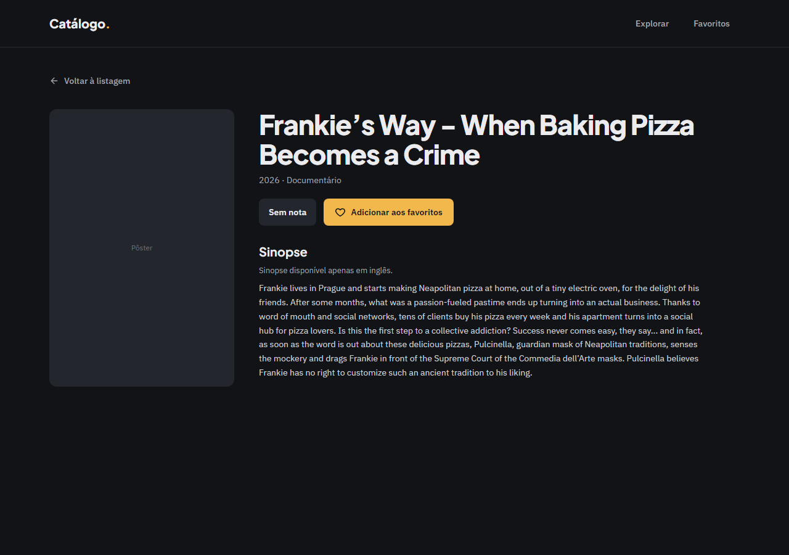
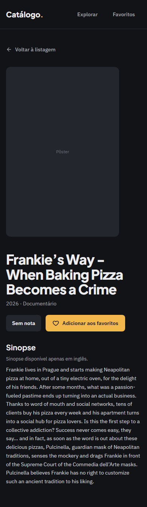
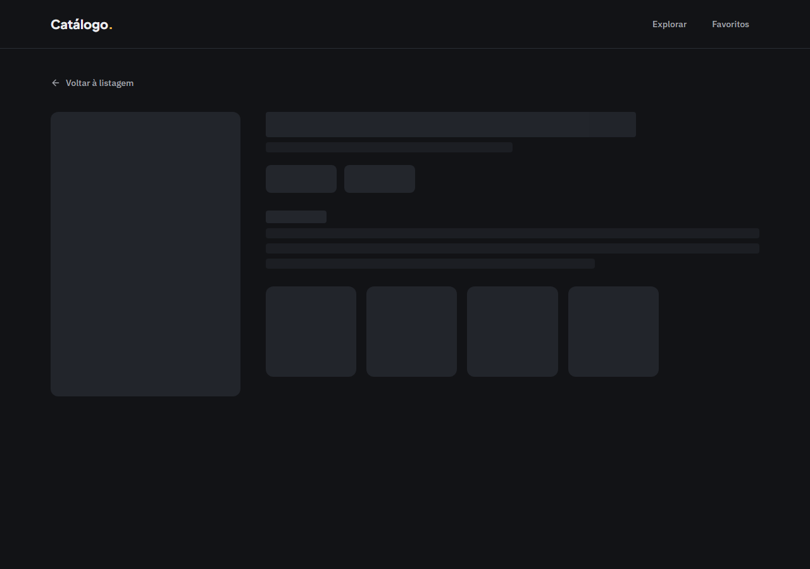
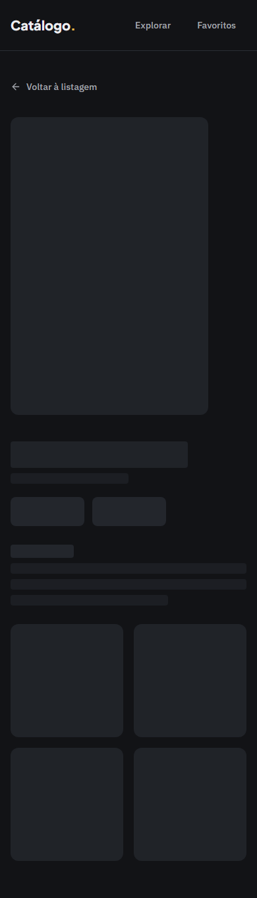

# Evidência — Task #L6-3 — Componentes de apresentação

**Parent item pai:** #L6 — Página de detalhe em /movie/[id]: sinopse (com fallback de idioma), nota, elenco principal e trailer quando houver
**Data:** 2026-10-07

## Resumo
Os blocos visuais do detalhe em `src/components/movie-detail/`, todos Server Components sem diretiva e sem hook: `BackLink`, `RatingChip`, `Overview` (três casos de D18), `CastCard`/`CastList`, `TrailerEmbed` (só YouTube nocookie, seção omitida sem vídeo), `MovieHeader` (com o `FavoriteButton` na variante `full`) e `DetailSkeleton`.

## Tasks de execução realizadas
- [x] 3.1 `BackLink.tsx` e `RatingChip.tsx`
- [x] 3.2 `Overview.tsx` + teste (D18)
- [x] 3.3 `CastCard.tsx`, `CastList.tsx` + teste (D23, D35)
- [x] 3.4 `TrailerEmbed.tsx` + teste (D19, D38)
- [x] 3.5 `MovieHeader.tsx` + teste (D23, D35, D40)
- [x] 3.6 `DetailSkeleton.tsx` (D37)

## Arquivos impactados
| Arquivo | Ação | Descrição |
|---------|------|-----------|
| `src/components/movie-detail/BackLink.tsx` | criado | `Link` "Voltar à listagem" com seta SVG `aria-hidden`, `min-h-11`, hover em `accent` |
| `src/components/movie-detail/RatingChip.tsx` | criado | Chip "Nota 8,7" ou "Sem nota" por `formatRating`, 44 px |
| `src/components/movie-detail/Overview.tsx` | criado | Seção "Sinopse": aviso antes do texto e `lang` no parágrafo fora do português; "Sinopse não disponível." mantendo o `h2` |
| `src/components/movie-detail/Overview.test.tsx` | criado | 8 testes: pt sem aviso, en com aviso e `lang="en"`, ausente, idioma desconhecido, `overviewNotice` |
| `src/components/movie-detail/CastCard.tsx` | criado | `figure` com foto `w185` ou placeholder "Foto", nome e personagem (omitido se vazio) |
| `src/components/movie-detail/CastList.tsx` | criado | `section` "Elenco principal" com `ul role="list"`, 2 colunas no mobile e `minmax(140px, 1fr)` acima; `[]` não renderiza nada; exporta `castGridClassName` |
| `src/components/movie-detail/CastList.test.tsx` | criado | 5 testes: sem elenco, figuras com nome e personagem, foto `w185`, placeholder sem foto, personagem vazio omitido |
| `src/components/movie-detail/TrailerEmbed.tsx` | criado | `iframe` `youtube-nocookie.com`, `title="Trailer: …"`, `loading="lazy"`; `null` não renderiza a seção |
| `src/components/movie-detail/TrailerEmbed.test.tsx` | criado | 4 testes, incluindo a chave codificada |
| `src/components/movie-detail/MovieHeader.tsx` | criado | Pôster `w500` (`preload`), `h1`, meta, `RatingChip`, `FavoriteButton full` e `children` na coluna da direita |
| `src/components/movie-detail/MovieHeader.test.tsx` | criado | 6 testes: `h1`, meta, nota e botão desligado; pôster `w500` com `preload` e sem `alt`; placeholder sem pôster; sem meta; sem votos; seções na coluna do título |
| `src/components/movie-detail/DetailSkeleton.tsx` | criado | `role="status"` "Carregando filme" com blocos `aria-hidden` nas mesmas caixas do detalhe |

## Decisões técnicas
Decisões 6 a 11 do `design.md`; D18 (fallback de sinopse), D19 e D38 (trailer só quando houver, sem lite embed), D23 e D35 (imagens e 390/1280 px), D37 (skeleton) e D40 (reuso do `FavoriteButton`). Ajustes do apply: o pôster usa `preload` no lugar de `priority` (deprecada no Next 16; achado do code review); `castGridClassName` é exportada para o skeleton; os testes não mockam `next/image`, que renderiza um `` no jsdom.

## Resultado
O detalhe completo (`/movie/603`), a sinopse só em inglês, a sinopse ausente, o filme sem elenco e o skeleton têm a aparência abaixo. Os ids usados vêm do TMDB em 2026-10-07: sinopse pt-BR 603; só em inglês 20000 (aviso "…apenas em inglês.", `lang="en"`); só em espanhol 1786782 (`lang="es"`); sem sinopse 1767731; sem elenco 1789955.

**QA** (`.work/changes/detalhe-filme/.devflow.yaml > qa`; `status: advisory-only`, `functional: pass`):
- E2E: spec `e2e/detalhe-filme.spec.ts` (17 testes por projeto); suíte inteira com 114 passed e 0 skipped (57 em `desktop`, 57 em `mobile`).
- Layout: `pass`. Gates `expectNoHorizontalOverflow`, `expectTokenColors`, `expectMinHeight`, `expectFontVariable` e `expectFocusRing` verdes em 1280 e 390 px. Findings em aberto (advisory): o estado de erro do detalhe não tem teste E2E versionado (o fetch é do servidor; foi conferido à mão e está coberto por `ErrorState.test.tsx`) e a `key` por `member.id` do `CastList` duplicaria se o TMDB repetisse a mesma pessoa entre os 8 primeiros (caso real não confirmado). Três findings resolvidos em 2 iterações.

**Capturas de layout**

| Tela | Desktop (1280 px) | Mobile (390 px) |
|------|-------------------|-----------------|
| `/movie/603` completo |  |  |
| Sinopse só em inglês (aviso antes do texto) |  |  |
| Sem sinopse |  |  |
| Sem elenco (seção some inteira) |  |  |
| Skeleton (shell sem JavaScript) |  |  |

## Observações
O navegador não desenha `outline` em `iframe`: o trailer recebe o foco na ordem certa, mas sem anel visível (o foco passa para o documento do player). Não mitigado. Os ids recentes podem ganhar dados no TMDB com o tempo.
