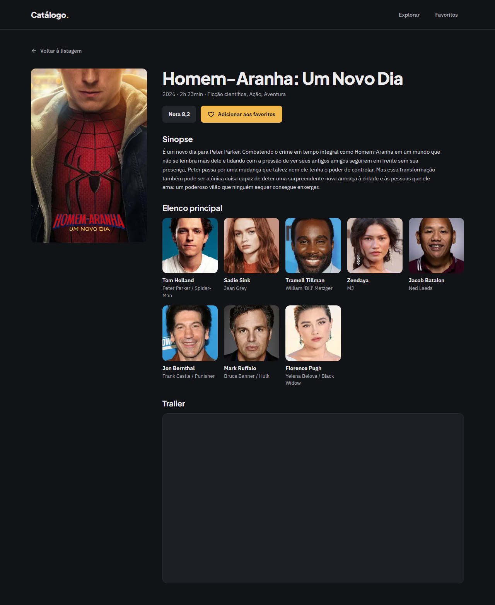
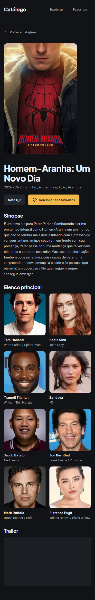

# Evidência — Task #L6-4 — Composição server

**Parent item pai:** #L6 — Página de detalhe em /movie/[id]: sinopse (com fallback de idioma), nota, elenco principal e trailer quando houver
**Data:** 2026-10-07

## Resumo
`MovieDetails` (RSC async) valida o id com `parseMovieId`, chama `getMovieDetail` uma única vez e distribui o `MovieDetail` pelos componentes de apresentação; id inválido ou `null` chamam `notFound()`, e os demais erros sobem ao `error.tsx`. `BackLinkLoader` lê `searchParams.from` e entrega o href de "Voltar" por `backHref`.

## Tasks de execução realizadas
- [x] 4.1 `MovieDetails.tsx` (D21; pilar 1)
- [x] 4.2 `BackLinkLoader.tsx` (D39)

## Arquivos impactados
| Arquivo | Ação | Descrição |
|---------|------|-----------|
| `src/components/movie-detail/MovieDetails.tsx` | criado | `await params` → `parseMovieId` → `getMovieDetail`; `MovieHeader` com `Overview`, `CastList` e `TrailerEmbed` como filhos; sem `try/catch` |
| `src/components/movie-detail/BackLinkLoader.tsx` | criado | `await searchParams` → `<BackLink href={backHref(from)} />` |

## Decisões técnicas
Decisões 3 e 4 do `design.md`; D21 (`not_found` vira `notFound()`, o resto vai ao `error.tsx`), D39 (`from` validado) e D7 (RSC async não roda no Vitest: sem teste unitário, verificação no browser). Pilar 1: o `await` fica dentro de componentes sob `<Suspense>`, nunca no corpo da página.

## Resultado
Uma chamada HTTP ao TMDB por render: com `logging.fetches` ligado temporariamente no `next dev`, `/movie/604` registra as duas chamadas de `getMovieDetail` (metadata e página) como uma ida ao TMDB e um acerto de cache; `/movie/abc` não registra nenhuma. A partir de um card da listagem, o detalhe abre com `?from=` e o botão volta preservando a busca e a página.

**QA** (`.work/changes/detalhe-filme/.devflow.yaml > qa`; `status: advisory-only`, `functional: pass`):
- E2E: spec `e2e/detalhe-filme.spec.ts` (17 testes por projeto); suíte inteira com 114 passed e 0 skipped (57 em `desktop`, 57 em `mobile`).
- Layout: `pass`. Gates `expectNoHorizontalOverflow`, `expectTokenColors`, `expectMinHeight`, `expectFontVariable` e `expectFocusRing` verdes em 1280 e 390 px. Findings em aberto (advisory): o estado de erro do detalhe não tem teste E2E versionado (o fetch é do servidor; foi conferido à mão e está coberto por `ErrorState.test.tsx`) e a `key` por `member.id` do `CastList` duplicaria se o TMDB repetisse a mesma pessoa entre os 8 primeiros (caso real não confirmado). Três findings resolvidos em 2 iterações.

**Capturas de layout**

| Tela | Desktop (1280 px) | Mobile (390 px) |
|------|-------------------|-----------------|
| Detalhe aberto a partir de um card da listagem |  |  |

## Observações
Nenhuma.
