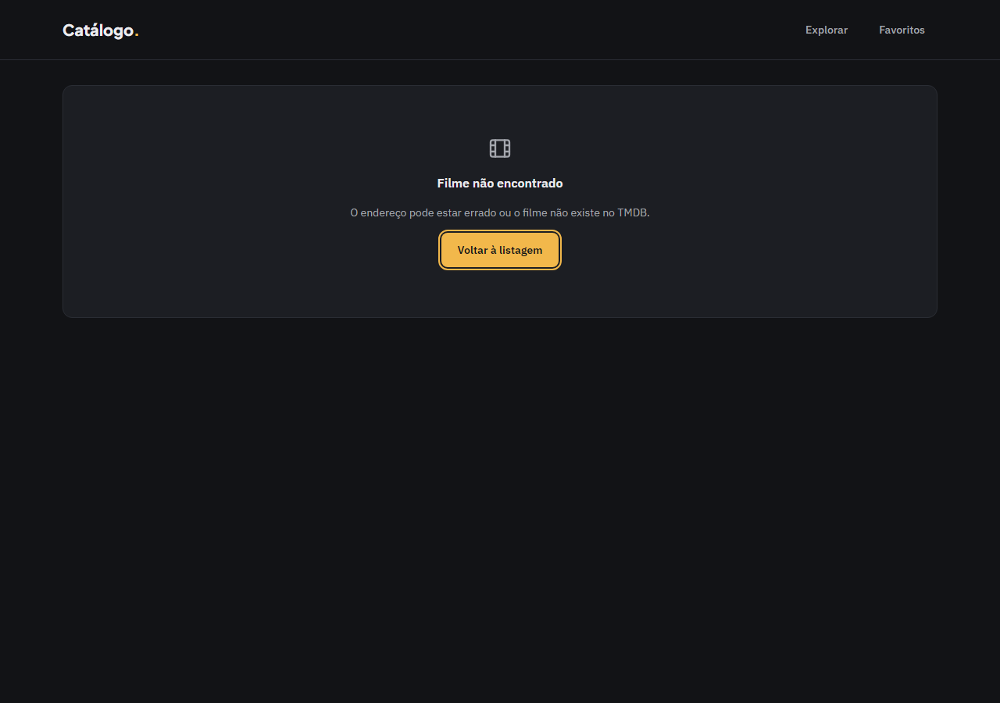
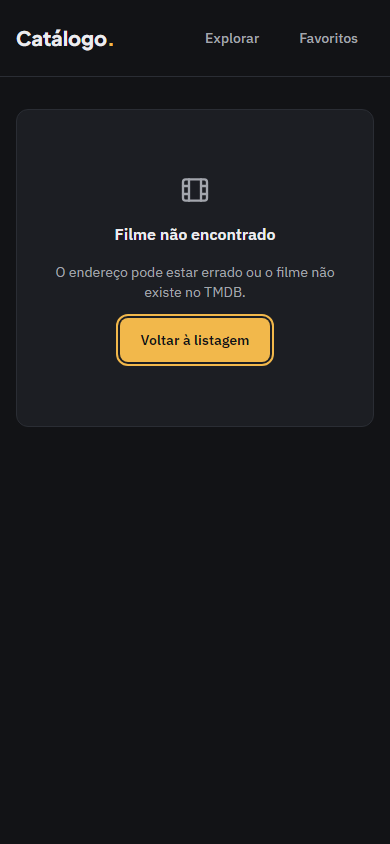
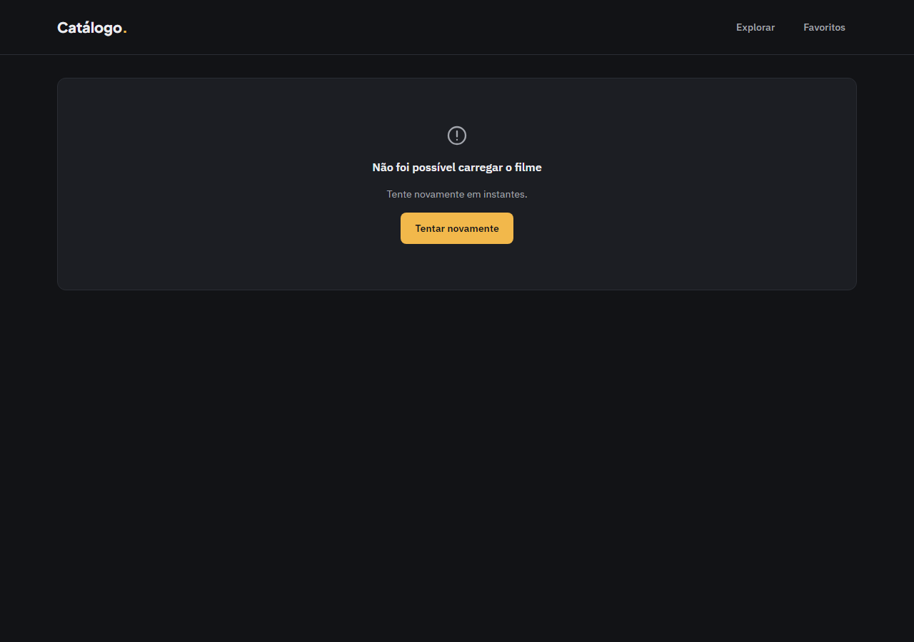
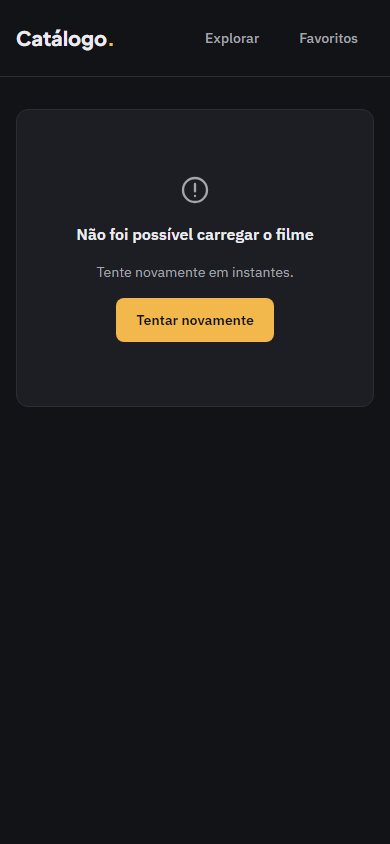

# Evidência — Task #L6-5 — Rotas

**Parent item pai:** #L6 — Página de detalhe em /movie/[id]: sinopse (com fallback de idioma), nota, elenco principal e trailer quando houver
**Data:** 2026-10-07

## Resumo
A rota `/movie/[id]` com `page.tsx` (shell com dois `<Suspense>` irmãos: `BackLinkLoader` com fallback `BackLink href="/"` e `MovieDetails` com fallback `DetailSkeleton`), `generateMetadata` com título do filme, `not-found.tsx` com o `EmptyState` de filme e `error.tsx` com o `ErrorState` do detalhe.

## Tasks de execução realizadas
- [x] 5.1 `page.tsx` com `generateMetadata` (D2, D37, D39)
- [x] 5.2 `not-found.tsx` (D36, D37)
- [x] 5.3 `error.tsx` (D21, D37)

## Arquivos impactados
| Arquivo | Ação | Descrição |
|---------|------|-----------|
| `src/app/movie/[id]/page.tsx` | criado | `article` com os dois `<Suspense>`; `generateMetadata` devolve o título do filme, "Filme não encontrado" (id inválido ou inexistente) ou "Filme" (erro); sem `await` no corpo e sem `generateStaticParams` |
| `src/app/movie/[id]/not-found.tsx` | criado | `EmptyState` com ícone `film`, "Filme não encontrado" e ação "Voltar à listagem" para `/` |
| `src/app/movie/[id]/error.tsx` | criado | Ilha client com `ErrorState` e título "Não foi possível carregar o filme"; props tipadas como as do `src/app/error.tsx` |

## Decisões técnicas
Decisões 2, 3 e 12 do `design.md`; D2 (o mesmo código nos dois modos de `cacheComponents`), D36 e D37 (estados de tela) e D21. Registro do apply: o status HTTP do not-found é 200 com `<meta name="robots" content="noindex">` nos dois modos (`next dev` e `next start`, com e sem a flag, inclusive com user-agent de bot), porque o `notFound()` acontece dentro do Suspense depois de o streaming começar. O Next injeta duas tags `robots` idênticas; nenhuma vem de `src/`.

## Resultado
`/movie/abc`, `/movie/0`, `/movie/0603` e `/movie/999999999` mostram o not-found com o `Header` visível, a aba "Filme não encontrado · Catálogo." e o botão que leva a `/`; os ids inválidos não geram chamada ao TMDB. Sem token, o `error.tsx` mostra "Não foi possível carregar o filme", "Tente novamente em instantes." e o botão de 44 px, com a aba "Filme".

**QA** (`.work/changes/archive/2026-10-07-detalhe-filme/.devflow.yaml > qa`; `status: advisory-only`, `functional: pass`):
- E2E: spec `e2e/detalhe-filme.spec.ts` (17 testes por projeto); suíte inteira com 114 passed e 0 skipped (57 em `desktop`, 57 em `mobile`).
- Layout: `pass`. Gates `expectNoHorizontalOverflow`, `expectTokenColors`, `expectMinHeight`, `expectFontVariable` e `expectFocusRing` verdes em 1280 e 390 px. Findings em aberto (advisory): o estado de erro do detalhe não tem teste E2E versionado (o fetch é do servidor; foi conferido à mão e está coberto por `ErrorState.test.tsx`) e a `key` por `member.id` do `CastList` duplicaria se o TMDB repetisse a mesma pessoa entre os 8 primeiros (caso real não confirmado). Três findings resolvidos em 2 iterações.

**Capturas de layout**

| Tela | Desktop (1280 px) | Mobile (390 px) |
|------|-------------------|-----------------|
| Not-found (`/movie/abc`) |  |  |
| Erro do segmento (build sem token) |  |  |

## Observações
A captura do estado de erro vem da conferência manual com `TMDB_API_READ_TOKEN=` vazio sobre o build de produção; não há E2E versionado para ele.
