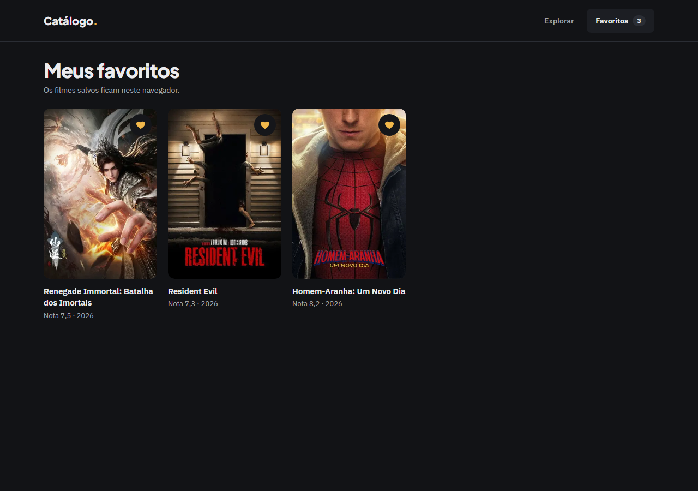
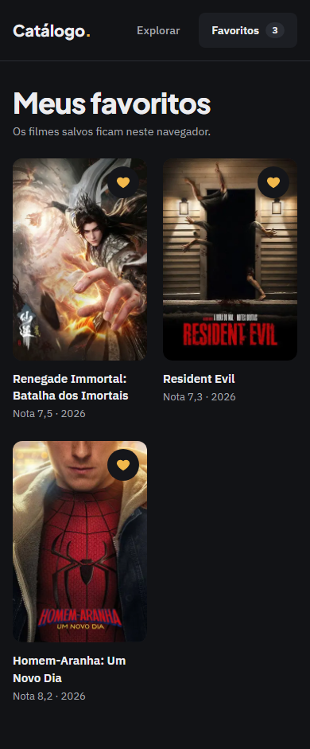
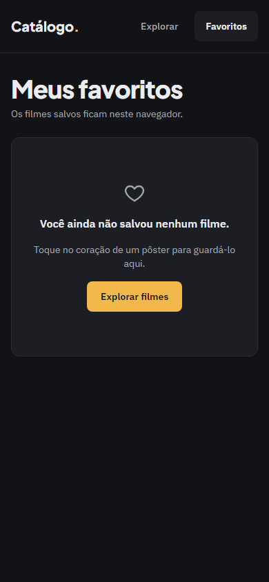
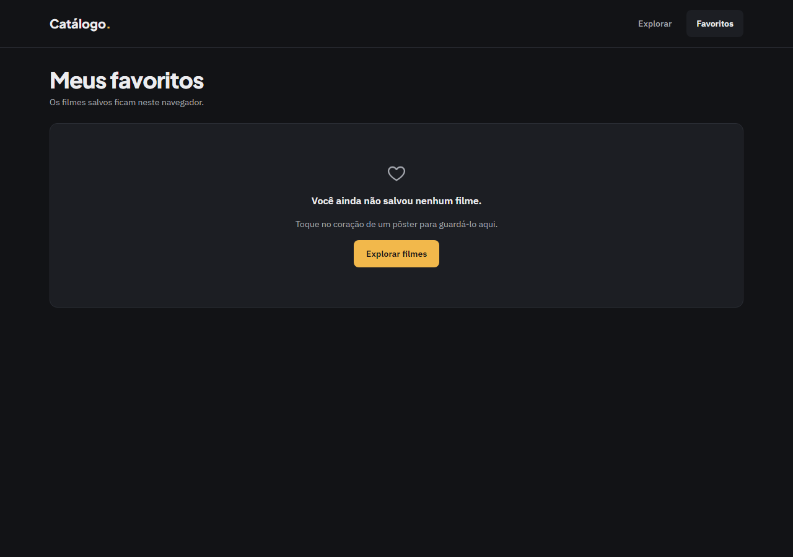

# Evidência — Task #L7-4 — Componentes FavoriteButton, FavoritesBadge e FavoritesList

**Parent item pai:** #L7 — Favoritos: persistência no client e página/aba que liste os favoritos
**Data:** 2026-10-07

## Resumo
Três ilhas client em `src/components/favorites/`: `FavoriteButton` (variantes `icon` e `full`, `aria-pressed`, nome alternando entre "Adicionar aos favoritos" e "Remover dos favoritos"), `FavoritesBadge` (contagem, oculto em 0, nome "N favorito(s)") e `FavoritesList` (nada antes de hidratar, `EmptyState` com coração ou `MovieGrid`). Commit `5e82e8c`.

## Tasks de execução realizadas
- [x] 4.1 `FavoriteButton.tsx` + `FavoriteButton.test.tsx`
- [x] 4.2 `FavoritesBadge.tsx` + `FavoritesBadge.test.tsx`
- [x] 4.3 `FavoritesList.tsx` + `FavoritesList.test.tsx`

## Arquivos impactados
| Arquivo | Ação | Descrição |
|---------|------|-----------|
| `src/components/favorites/FavoriteButton.tsx` | criado | Botão `icon` (40 × 40 px sobre o pôster) e `full` (`min-h-11`); SVG só com `currentColor`/`none`; `Date.now()` fica no store |
| `src/components/favorites/FavoriteButton.test.tsx` | criado | 9 testes: estados, payload com as sete chaves sem `posterUrl`/`releaseYear`, alternância e dois botões em sincronia |
| `src/components/favorites/FavoritesBadge.tsx` | criado | Pílula `bg-border-subtle`, `null` com contagem 0 |
| `src/components/favorites/FavoritesBadge.test.tsx` | criado | 6 testes: vazio, singular, plural e nome acessível |
| `src/components/favorites/FavoritesList.tsx` | criado | `!hydrated` → `null`; vazio do protótipo com ação "Explorar filmes"; senão `MovieGrid` com `toMovieCardData` |
| `src/components/favorites/FavoritesList.test.tsx` | criado | 6 testes: vazio, ordem do mais recente, remoção pelo coração |

## Decisões técnicas
Decisões 6 a 8 do `design.md`; D31 (nenhuma leitura de storage no render do servidor); D33 (cores só por token, `accent` só no favorito ativo). Ajuste do apply (task 6.5): o `transition-colors` previsto para o `icon` saiu, porque só animava o `outline-color` do anel de foco (medido: `rgb(236, 236, 239)` logo após o Tab, `rgb(242, 184, 75)` depois).

## Resultado
O coração alterna e preenche em âmbar quando ativo; o badge conta e some em zero; a lista mostra o vazio do protótipo ou a grade em ordem de inclusão. Os 21 testes dos três componentes passam.

**QA** (`.work/changes/favoritos/.devflow.yaml > qa`; `status: passed`, `functional: pass`):
- E2E: specs `e2e/favoritos.spec.ts` (22 testes) e `e2e/shell.spec.ts` (gates de `/favoritos`), 82 passed e 0 skipped (41 em `desktop`, 41 em `mobile`).
- Layout: `pass`. Gates `expectNoHorizontalOverflow`, `expectTokenColors`, `expectMinHeight`, `expectFontVariable` e `expectFocusRing` verdes em 1280 e 390 px; revisão visual sem divergência. Findings em aberto: nenhum (5 resolvidos na iteração 1).

**Capturas de layout**

| Tela | Desktop (1280 px) | Mobile (390 px) |
|------|-------------------|-----------------|
| Favoritos carregado (cards em ordem, corações preenchidos) |  |  |
| Favoritos vazio, depois de remover o último |  |  |
| Favoritos vazio no primeiro acesso (storage corrompido ou ausente) |  |  |

## Observações
Os estados acima são afirmados pelo spec E2E; o `FavoriteButton` na variante `full` só entra em tela no `detalhe-filme` e ficou fora do E2E (`qa.not_covered_e2e`).
