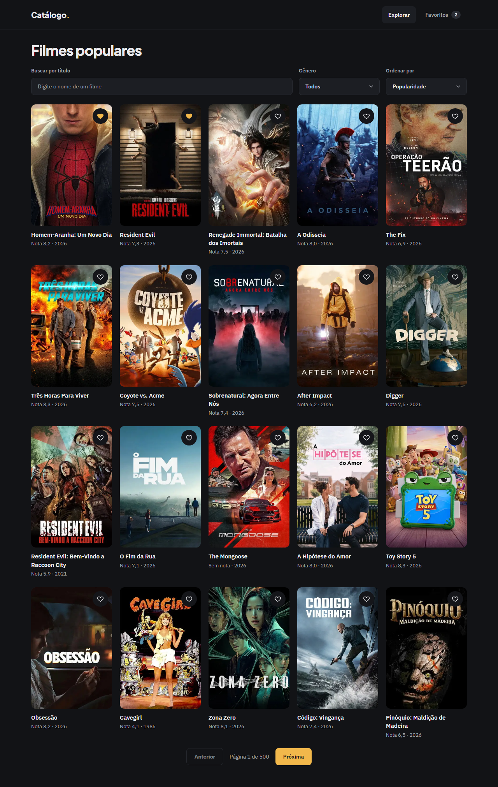
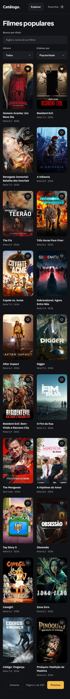

# Evidência — Task #L7-5 — Integração: card, header e página

**Parent item pai:** #L7 — Favoritos: persistência no client e página/aba que liste os favoritos
**Data:** 2026-10-07

## Resumo
O `MovieCard` passa a renderizar `<FavoriteButton variant="icon" />` como irmão do `<Link>` do pôster; o `Header` coloca o `FavoritesBadge` dentro do `NavLink` de Favoritos; `/favoritos` vira um RSC estático com `h1`, subtítulo e `FavoritesList`. Commit `23220b5`.

## Tasks de execução realizadas
- [x] 5.1 Alterar `src/components/movies/MovieCard.tsx` e `MovieCard.test.tsx`
- [x] 5.2 Alterar `src/components/layout/Header.tsx`
- [x] 5.3 Reescrever `src/app/favoritos/page.tsx`

## Arquivos impactados
| Arquivo | Ação | Descrição |
|---------|------|-----------|
| `src/components/movies/MovieCard.tsx` | alterado | `FavoriteButton` no lugar do comentário reservado; sem `"use client"` |
| `src/components/movies/MovieCard.test.tsx` | alterado | Botão `aria-pressed="false"` fora de qualquer `a` (11 testes) |
| `src/components/layout/Header.tsx` | alterado | `Favoritos<FavoritesBadge />` no `NavLink`; `Header` segue sem diretiva |
| `src/app/favoritos/page.tsx` | alterado | `metadata.title "Meus favoritos"`, `h1`, subtítulo e `FavoritesList`; sem `await`, `fetch` nem `searchParams` |

## Decisões técnicas
Decisão 9 (botão irmão do link: botão dentro de `a` é HTML inválido e o `aria-pressed` entraria no nome do link), decisão 7 (slot `children` do `NavLink`) e decisão 8 (página estática: a parte dinâmica acontece no client depois de montar). Ajuste do apply (task 1.1): o `div` do pôster não tem `overflow-hidden`.

## Resultado
A listagem mostra um coração em cada card, a aba Favoritos mostra o badge e `/favoritos` é prerenderizada (`○`) nos dois modos de `cacheComponents`. O link do card em `/favoritos` é `/movie/{id}`, sem `?from=`.

**QA** (`.work/changes/archive/2026-10-07-favoritos/.devflow.yaml > qa`; `status: passed`, `functional: pass`):
- E2E: specs `e2e/favoritos.spec.ts` (22 testes) e `e2e/shell.spec.ts` (gates de `/favoritos`), 82 passed e 0 skipped (41 em `desktop`, 41 em `mobile`).
- Layout: `pass`. Gates `expectNoHorizontalOverflow`, `expectTokenColors`, `expectMinHeight`, `expectFontVariable` e `expectFocusRing` verdes em 1280 e 390 px; revisão visual sem divergência. Findings em aberto: nenhum (5 resolvidos na iteração 1).

**Capturas de layout**

| Tela | Desktop (1280 px) | Mobile (390 px) |
|------|-------------------|-----------------|
| Listagem com favoritos (corações preenchidos e badge na aba) |  |  |
| `/favoritos` (gates do shell) |  |  |

## Observações
As capturas de `/favoritos` carregado e vazio estão na evidência L7-4.
