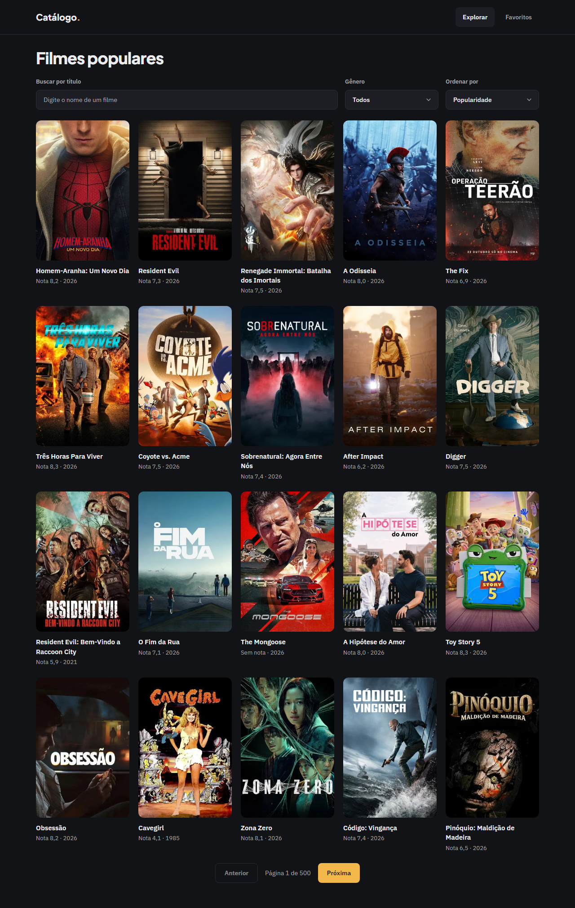
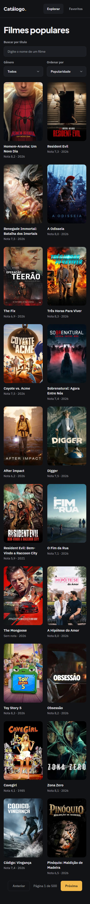
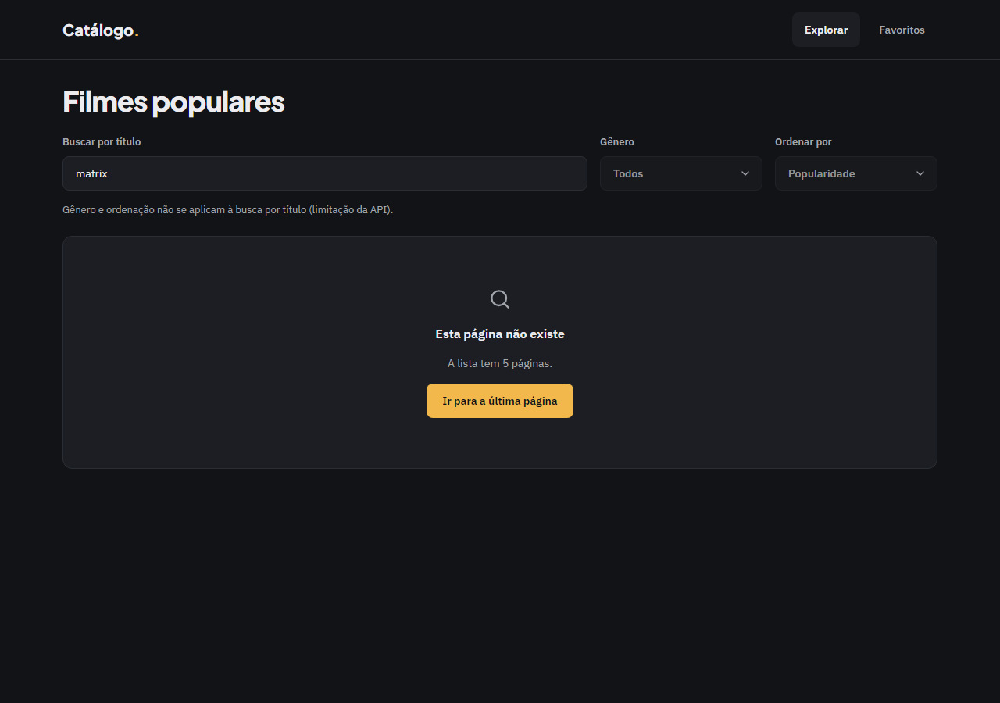
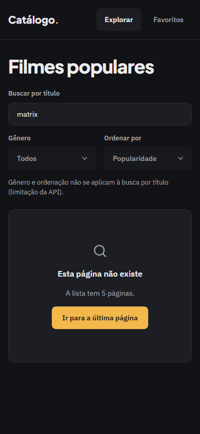

# Evidência — Task #L2-8 — Verificação no browser e nos dois modos

**Parent item pai:** #L2 — Listagem de filmes populares com paginação
**Data:** 2026-10-07

## Resumo
Os populares com paginação foram conferidos no browser (8.1), os estados de carregando, erro e token ausente (8.5), 390 e 1280 px com teclado (8.6) e o build e o `next dev` com `CATALOGO_CACHE_COMPONENTS=1` (8.7). Depois, a fase de QA cobriu a tela com E2E e gates de layout nos projetos `desktop` e `mobile`.

## Tasks de execução realizadas
- [x] 8.1 Populares e paginação
- [x] 8.5 Estados: carregando, vazio, erro, token ausente
- [x] 8.6 390 px e 1280 px, teclado
- [x] 8.7 Build e `next dev` com `CATALOGO_CACHE_COMPONENTS=1` (D42)

## Arquivos impactados
| Arquivo | Ação | Descrição |
|---------|------|-----------|
| `src/components/movies/FilterBar.tsx` | alterado | Selects com `min-w-0 flex-1 basis-36 sm:flex-initial sm:basis-52`, para ficarem lado a lado a 390 px (achado da 8.6) |
| `src/components/movies/MovieCard.tsx` | alterado | Pôster sem `overflow-hidden`, para o anel de foco aparecer (achado da 8.6) |
| `src/components/movies/MovieResults.tsx` | alterado | `await connection()` antes de `fetchListing` (achado da 8.7) |
| `e2e/listagem-filmes.spec.ts` | criado | Spec E2E e de layout da listagem (QA) |
| `e2e/support/layout.ts`, `playwright.config.ts`, `src/app/globals.css` | alterado | Helpers de layout, configuração do Playwright e base de 14 px no corpo (achado de layout do QA) |

## Decisões técnicas
Ajustes do apply 1 a 3 (ver `design.md` › "Ajustes do apply") e do QA (ver "Ajustes do QA"). D35 define os dois tamanhos de tela; D42 define os dois modos de `cacheComponents`.

## Resultado
**Task 8.7 (resumo).** `CATALOGO_CACHE_COMPONENTS=1 npm run build` sem `.env.local` e sem rede: verde, com `/` listada como `◐` (shell estático com buracos) e `/favoritos` como `○` (estática). `next dev` com a flag, abrindo `/`, `/?q=matrix`, `/?page=2` e `/?genre=28&sort=rating`: sem insight de blocking-route (depois do `await connection()` em `MovieResults`), sem erro de `useSearchParams` sem Suspense e sem IO síncrono. O build sem a flag segue verde.

**QA (`.work/changes/listagem-filmes/.devflow.yaml > qa`):** 2 iterações, 6 findings resolvidos, `functional: pass` (`npm run check` com 180 testes e build verdes), status `advisory-only`.
- E2E: spec `e2e/listagem-filmes.spec.ts`, 38 passed e 0 skipped nos projetos desktop e mobile, em duas execuções seguidas.
- Layout: `pass`. Gates `expectNoHorizontalOverflow`, `expectTokenColors`, `expectMinHeight`, `expectFontVariable` e `expectFocusRing` verdes. Finding em aberto (baixo, `suggestion`, `src/app/page.tsx`): o `h1` está em `text-4xl` (36 px) contra 40 px/1.1/-0.01em do README de design; o `design.md` prescreve `text-4xl`, herdado do `setup-catalogo`.

**Capturas de layout**

| Tela | Desktop (1280 px) | Mobile (390 px) |
|------|-------------------|-----------------|
| Carregado (20 cards e paginação) |  |  |
| Página inexistente |  |  |

## Observações
Limites conhecidos: o skeleton e o fallback "Carregando gêneros…" foram conferidos só no HTML do build, sem captura nem E2E; o erro de API e o token ausente foram verificados manualmente em `next dev`. As capturas de gênero, busca e sem resultado estão nas evidências de L3 e L4.
