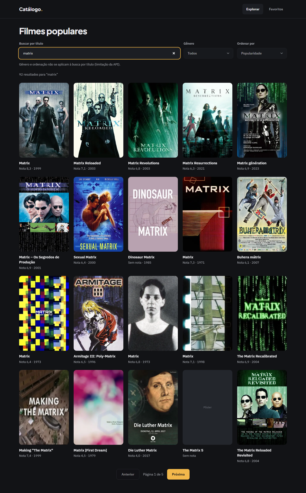
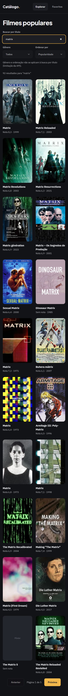
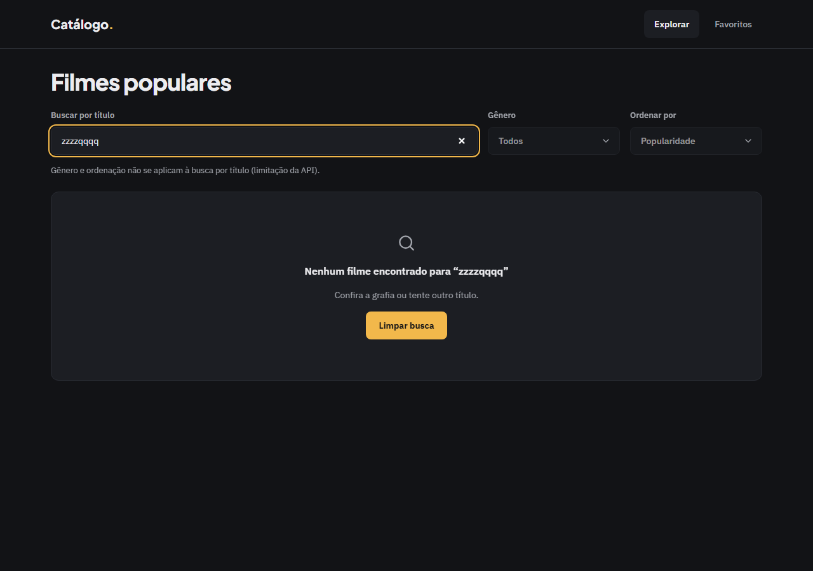
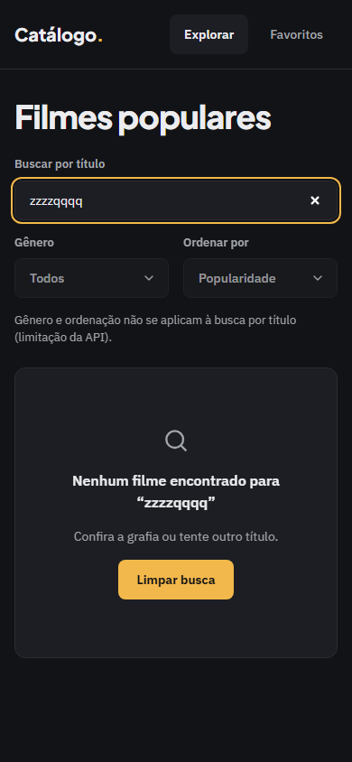

# Evidência — Task #L3-5 — FilterBar: estrutura, busca com debounce e teste

**Parent item pai:** #L3 — Busca por título
**Data:** 2026-10-07

## Resumo
`FilterBar` nasce como ilha client com `form role="search"`, campo "Buscar por título" não controlado e debounce de 350 ms que aplica `router.replace` dentro de uma transição; Enter aplica na hora. Em fallback (`disabled`), renderiza os três controles desabilitados sem ler a URL. Commits `da43c35` e `8984c2d`.

## Tasks de execução realizadas
- [x] 5.1 `src/components/movies/FilterBar.tsx`: estrutura, fallback e campo de busca com debounce
- [x] 5.4 `src/components/movies/FilterBar.test.tsx`

## Arquivos impactados
| Arquivo | Ação | Descrição |
|---------|------|-----------|
| `src/components/movies/FilterBar.tsx` | criado | `FilterBar` escolhe `FilterBarFields` (sem hooks, fallback) ou `LiveFilterBar` (`useSearchParams`, `useRouter`, debounce, sincronização com a URL) |
| `src/components/movies/FilterBar.test.tsx` | criado | 18 testes com timers falsos, de busca, gênero, ordenação, modo busca e fallback (cobertos aqui e em L4/L5) |

## Decisões técnicas
Decisões 5 e 6 do `design.md`; D25 (debounce com `replace`, uma entrada de histórico) e D26 (transição). Ajuste do QA: o efeito de sincronização do campo passou a rodar a cada URL nova, depois que a transição assenta (`syncedUrlRef`). Antes, uma busca enviada e superada por outra navegação sem `q` (trocar gênero, paginar) deixava o texto no campo com a URL sem busca. Reproduzido no browser antes da correção e coberto por teste de unidade e E2E.

## Resultado
A URL vira `/?q=matrix` só depois de parar de digitar; "Limpar busca" e apagar o campo levam a `/`. Voltar e avançar sincronizam o campo. A busca sem resultado mostra "Nenhum filme encontrado para “…”".

**QA** (`.work/changes/listagem-filmes/.devflow.yaml > qa`; status `advisory-only`, `functional: pass`):
- E2E: spec `e2e/listagem-filmes.spec.ts`, 38 passed e 0 skipped nos projetos desktop e mobile.
- Layout: gates (`expectNoHorizontalOverflow`, `expectTokenColors`, `expectMinHeight`, `expectFontVariable`, `expectFocusRing`) verdes nas duas larguras. Finding em aberto (baixo, `suggestion`, `src/app/page.tsx`): `h1` em `text-4xl` (36 px) contra 40 px/1.1/-0.01em do README de design; o `design.md` prescreve `text-4xl`, herdado do `setup-catalogo`.

| Tela | Desktop (1280 px) | Mobile (390 px) |
|------|-------------------|-----------------|
| Busca ativa |  |  |
| Busca sem resultado |  |  |

## Observações
Nenhuma além do finding de layout acima.
