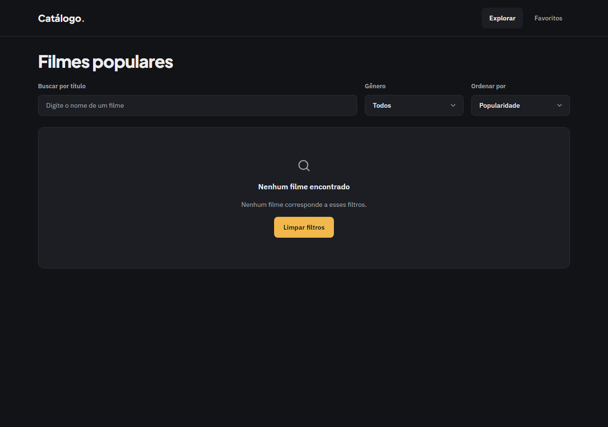
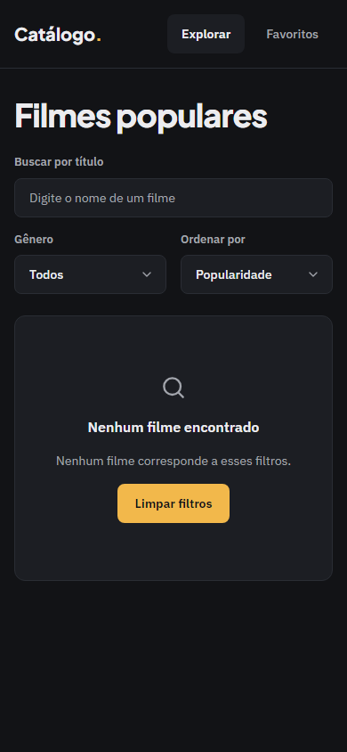

# Evidência — Task #L4-8 — Filtro por gênero no browser

**Parent item pai:** #L4 — Filtro por gênero
**Data:** 2026-10-07

## Resumo
Verificação do filtro no browser: escolher "Ação" e depois "Todos", abrir `/?genre=28&page=3` e `/?genre=999999`, e o select desabilitado com "Carregando gêneros…" no primeiro carregamento.

## Tasks de execução realizadas
- [x] 8.3 Filtro por gênero

## Arquivos impactados
| Arquivo | Ação | Descrição |
|---------|------|-----------|
| `e2e/listagem-filmes.spec.ts` | criado | Casos de gênero: escolhe, zera a página, preserva a ordenação, voltar retorna, sem resultado com "Limpar filtros", escolha otimista em rede lenta |

## Decisões técnicas
D22 (gêneros em RSC com `connection()`) e o `useOptimistic` do ajuste do QA (ver task L4-5).

## Resultado
O select lista os gêneros de `getGenres()`; escolher cria `/?genre=28` com `push` e zera a página; `/?genre=28&page=3` abre na página 3 com "Ação" selecionado. QA: E2E 38 passed e 0 skipped (desktop e mobile); layout verde nos gates, com o finding baixo do `h1` em aberto.

## Observações
Limite conhecido: o fallback "Carregando gêneros…" foi conferido só no HTML do build.
